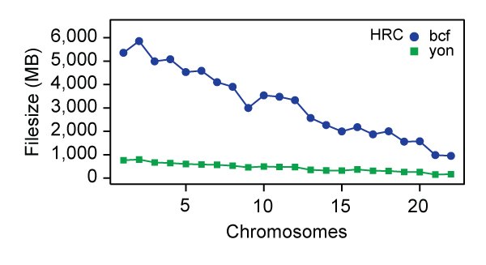
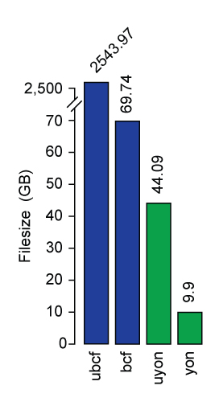

  

Tachyon is an open source C++ software library for reading, writing, and manipulating sequence variant data in a lossless and bit-exact representation. It is completely compatible with BCF/VCF. It was developed with a focus on enabling fast experimentation and storage of population-scaled datasets.

## How does it work?

Tachyon stores data in a format that optimize query execution (column store). Additionally, this data layout generally results in considerable gains in compression
as similar data are stored together separately. Tachyon can be considered the equivalent of what [CRAM](http://samtools.github.io/hts-specs/) is for SAM/BAM but for sequence variant data (VCF/BCF).

## Documentation

* Overview.
* [Building and installing](docs/building.md)
* [Getting started](docs/getting_started.md)
* [Performance benchmarks](docs/benchmarks.md)

## Perfomance

The following tests were run on the first release of [Haplotype Reference Consortium](http://www.haplotype-reference-consortium.org/) (HRC) data. There are ~39 million phased SNPs in 32,488 samples. Left panel: Filesizes for chromosomes 1-22. Right panel: We generated a yon archive for this dataset (left) and compared file sizes for both uncompressed (ubcf and uyon) and compressed data (bcf and yon).

Compression Ratio / Chromosome | Compression Ratio
------------------|-------------------
 | 

The following tests were run on the [1000 Genomes Phase 3](http://www.internationalgenome.org/) (1KGP3) data. There are ~84.4 million phased SNPs in 2,504 samples from 26 distinct populations.

Compression Ratio / Chromosome | Compression Ratio
------------------|-------------------
 | 

ubcf: uncompressed bcf; uyon: uncompressed yon; 1 GB = 1000 * 1000 * 1000 b

The references system used was a server running Linux Ubuntu, with an Intel Xeon E5-2697 v3 processor, 64GB of DDR4-2133 RAM, and a pair of Intel SSE 750 NVMe drives running in RAID-0.

### Evaluation performance
The following tests were run to benchmark the processing time of various `yon` archives. For these tests we use three distinct datasets: 1) [1000 Genomes Phase 3](http://www.internationalgenome.org/) (1KGP3) chromosome 11; 2) [Haplotype Reference Consortium](http://www.haplotype-reference-consortium.org/) (HRC) chromosome 11; and 3) [Human Genome Diversity Project](http://www.hagsc.org/hgdp/) (HGDP) chromosome 10. 

| Dataset     | Variants | #INFO | #FORMAT | ubcf      | bcf       | uyon      | yon       |
|-------------|----------|-------|---------|-----------|-----------|-----------|-----------|
| 1kgp3-chr11 | 4,045,628  | 24    | 1       | 20.60 GB  | 633.70 MB | 670.29 MB | 157.28 MB |
| HRC-chr11   | 1,936,990  | 6     | 1       | 125.90 GB | 3.48 GB   | 1.47 GB   | 461.96 MB |
| HGDP-chr10  | 3,766,673  | 24    | 9       | 73.93 GB  | 19.07 GB  | 67.76 GB  | 14.40 GB  |

\#INFO: number of INFO fields; \#FORMAT: number of FORMAT fields; ubcf: uncompressed bcf; uyon: uncompressed yon; 1 MB = 1000 * 1000 b

---  

### Contributing

Interested in contributing? Fork and submit a pull request and it will be reviewed.

### Support
We are actively developing Tachyon and are always interested in improving its quality. If you run into an issue, please report the problem on our Issue tracker. Be sure to add enough detail to your report that we can reproduce the problem and address it. We have not reached version 1.0 and as such the specification and/or the API interfaces may change.

### Version
This is Tachyon 0.6.1. Tachyon follows [semantic versioning](https://semver.org/).

### History
Tachyon grew out of the [Tomahawk][tomahawk] project for calculating genome-wide linkage-disequilibrium.

### Author
Marcus D. R. Klarqvist (<mk819@cam.ac.uk>)  
Department of Genetics, University of Cambridge  
Wellcome Trust Sanger Institute

### Acknowledgements
[James Bonfield](https://github.com/jkbonfield), Wellcome Trust Sanger Institute  
[Petr Daněček](https://github.com/pd3), Wellcome Trust Sanger Institute  
[Richard Durbin](https://github.com/richarddurbin), Wellcome Trust Sanger Institute, and Department of Genetics, University of Cambridge  

### License
Tachyon is licensed under [MIT](LICENSE)

[openssl]:  https://www.openssl.org/
[zstd]:     https://github.com/facebook/zstd
[tomahawk]: https://github.com/mklarqvist/tomahawk
[msprime]:  https://github.com/jeromekelleher/msprime